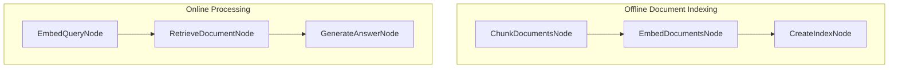

# PoC RAG Agent

PoC RAG agent about endurance sport. 

## Features

- Document chunking for processing long texts
- FAISS-powered vector-based document retrieval
- OpenAI embedding

## How It Works

Two-phase pipeline:

Here's what each part does:
1. **ChunkDocumentsNode**: Breaks documents into smaller chunks for better retrieval
2. **EmbedDocumentsNode**: Converts document chunks into vector representations
3. **CreateIndexNode**: Creates a searchable FAISS index from embeddings
4. **EmbedQueryNode**: Converts user query into the same vector space
5. **RetrieveDocumentNode**: Finds the most similar document using vector search
6. **GenerateAnswerNode**: Uses an LLM to generate an answer based on the retrieved content
